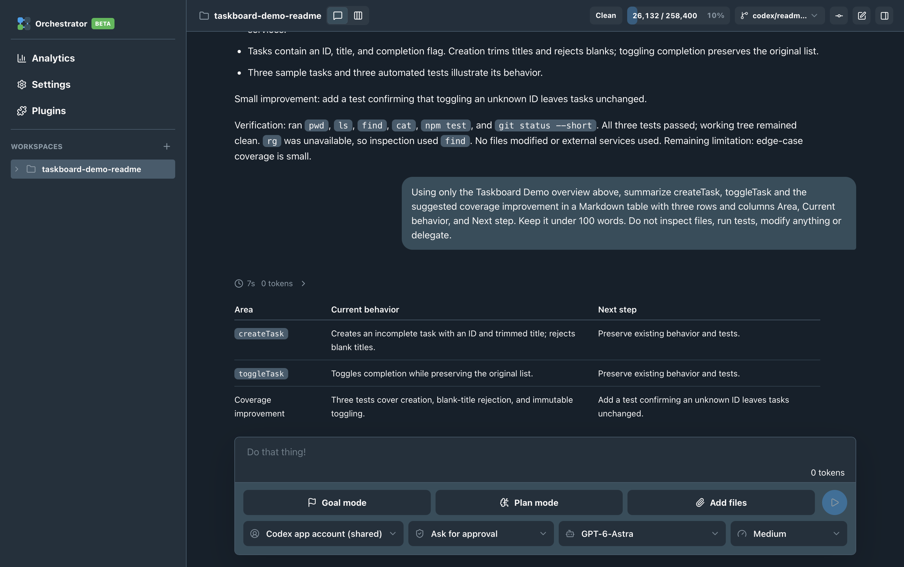
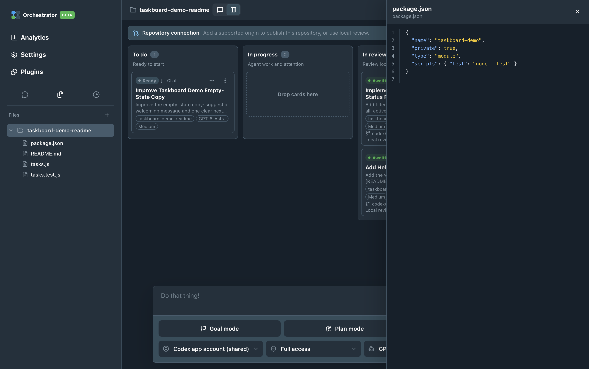
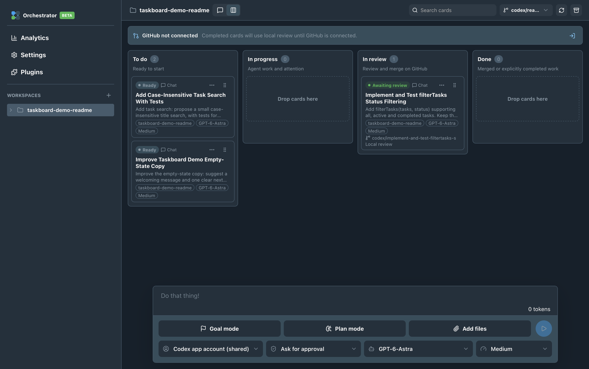
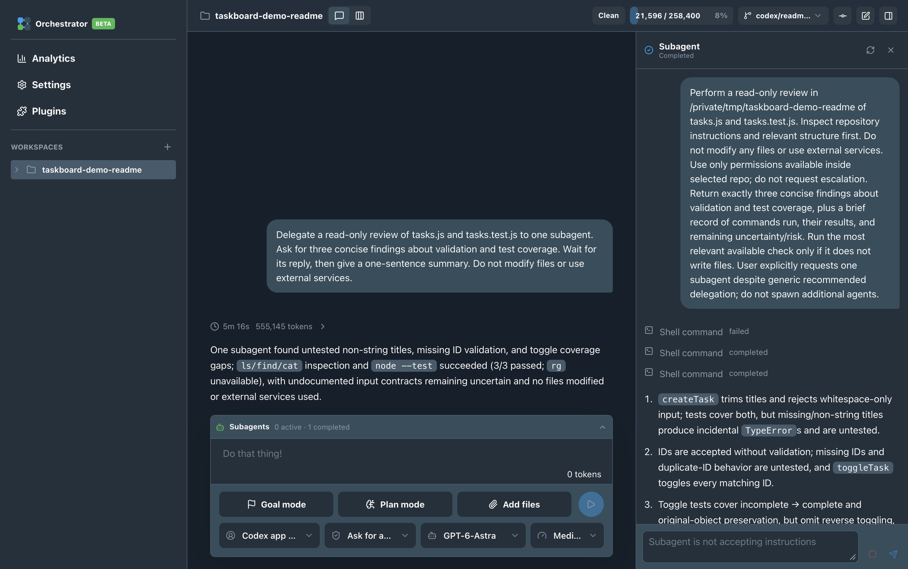
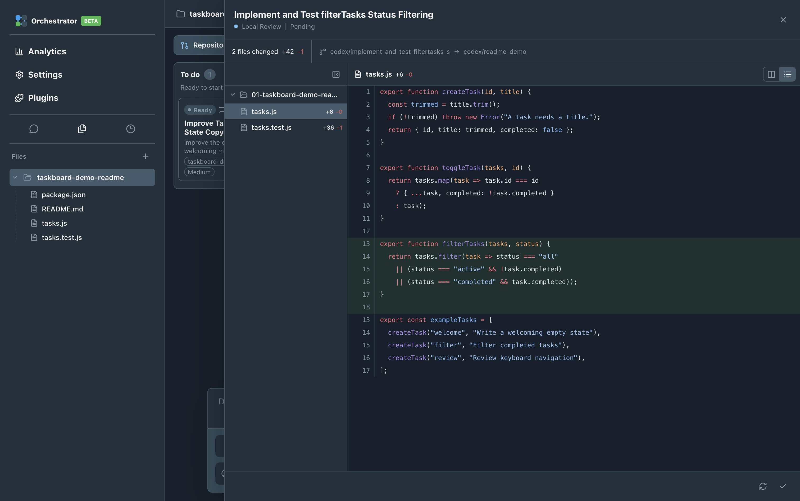
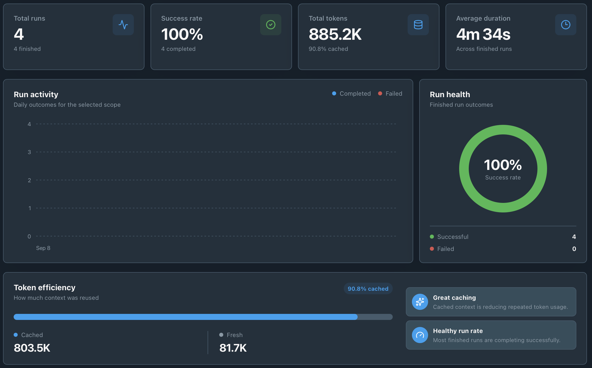

<p align="center">
  
</p>

<h1 align="center">Orchestrator</h1>

<p align="center">
  A macOS workspace for AI-assisted development.<br>
  Plan tasks, work with agents and review changes in one place.
</p>

<p align="center">
  <a href="https://github.com/zachealy1/orchestrator/actions/workflows/ci.yml"></a>
  &nbsp;·&nbsp; <a href="LICENSE">MIT licensed</a>
  &nbsp;·&nbsp; macOS 15+
</p>

<p align="center">
  <a href="#download-and-install">Download</a> ·
  <a href="#feature-tour">Feature tour</a> ·
  <a href="#build-from-source">Build from source</a> ·
  <a href="#documentation-and-support">Documentation</a> ·
  <a href="CONTRIBUTING.md">Contribute</a>
</p>

> **Experimental community beta.** Version **0.2.0-beta.2** supports **Apple Silicon and Intel** with signed in-app updates. It is **ad-hoc signed and not notarized by Apple**. The maintainer reports manual testing; see the [release acceptance record](docs/release-acceptance.md) for scope.

Orchestrator is an independent project, not an OpenAI product. Browser, Computer Use and plugin integrations are experimental and may require separately installed upstream components.

## Download and install

**[Download for Apple Silicon](https://github.com/zachealy1/orchestrator/releases/download/v0.2.0-beta.2/Orchestrator_aarch64.dmg)** · **[Download for Intel](https://github.com/zachealy1/orchestrator/releases/download/v0.2.0-beta.2/Orchestrator_x86_64.dmg)** · [All releases](https://github.com/zachealy1/orchestrator/releases)

Requires an **Apple Silicon or Intel Mac running macOS 15 or later**. No development tools or source build are needed to install the app.

1. Download `Orchestrator_aarch64.dmg` for Apple Silicon or `Orchestrator_x86_64.dmg` for Intel.
2. Open the disk image and drag **Orchestrator** into **Applications**.
3. Eject the disk image, then open Orchestrator from Applications.
4. Sign in with your own supported Codex account and add a workspace to get started.

macOS may block the first launch because this beta is not notarized. Read the [first-launch security guidance](docs/public/INSTALLATION.md#community-beta-macos-first-launch-warning) before deciding whether to open it. Never disable Gatekeeper globally.

**Updates download on click.** Use the account menu to download an available update, then choose **Install and restart**. If in-app updating is unavailable, **Download latest version** opens [Releases](https://github.com/zachealy1/orchestrator/releases) directly. See the [installation and update guide](docs/public/INSTALLATION.md) for details.

## Your work, in context

Start with a prompt, keep the conversation alongside your workspace, and follow the agent's work as it happens.

[](docs/assets/screenshots/chat.png)

*Chat, Kanban and Subagents use the maintainer's full-screen captures from 12 September 2026, showing the beta.2 candidate and fictional Taskboard Demo at 3024 × 1898. Account identities are removed; task results and activity remain genuine. Click any screenshot to view it at full size.*

## Feature tour

### Inspect file contents

Expand a workspace in the sidebar and select a file to read its contents beside your conversation. Syntax highlighting and line numbers make code and configuration easy to inspect without leaving the chat.

[](docs/assets/screenshots/file-contents.png)

### Organise work with Kanban

Turn ideas into cards and follow each task from preparation through execution and review. Select the target branch in the board toolbar for new card branches and pull requests. Chat and Kanban share the same workspace, so you can choose the view that fits the work.

[](docs/assets/screenshots/kanban.png)

*The target-branch selector sits immediately before refresh and archive. The existing demo cards retain their actual backlog and local-review states.*

### See what subagents are doing

Inspect a delegated task's original instruction, conversation and activity without losing the parent conversation.

[](docs/assets/screenshots/subagents.png)

### Review changes before publishing

Browse changed files, inspect the diff and decide whether to approve the work or request changes. Repository-specific review keeps changes understandable in both single- and multi-repository workspaces.

[](docs/assets/screenshots/change-review.png)

### Understand your activity

Explore local run activity, token totals and outcomes by workspace and date range. Account usage limits are shown separately using the limits Codex actually reports for the selected plan.

[](docs/assets/screenshots/analytics.png)

*The screenshot shows demo-project activity, not personal account quotas or a performance benchmark.*

## More ways to work

- **Plans and Goals:** Review a proposed plan before implementation, or pursue an explicit longer-running goal.
- **Generated-image previews:** Explore concepts in the conversation; copy images into a project when you explicitly request an asset.
- **Multi-repository workspaces:** Give agents the workspace context and review changes repository by repository.
- **Keyboard navigation:** Use `⌘K` for actions, `⌘N` for a new chat and `⌘/` for shortcut help.
- **Optional integrations:** Explore Plugins, Browser and Computer Use with their [experimental requirements and limitations](docs/public/INTEGRATIONS.md).

## Build from source

You need macOS, Xcode Command Line Tools, **Node.js 24**, npm and **Rust 1.96.0**. Build each architecture on matching hardware. Normal AI tasks require your own supported Codex account; GitHub authentication is separate.

```sh
git clone https://github.com/zachealy1/orchestrator.git
cd orchestrator
npm ci
npm run tauri dev
```

Build hooks prepare the pinned official standalone Codex engine, GitHub CLI and third-party notices, verifying the runtime downloads. No private-repository access or publishing credentials are required. Ordinary Chat and repository workflows do not require the Codex desktop app, Homebrew or a separately installed Codex CLI. Orchestrator does not redistribute private ChatGPT components.

<details>
<summary>Run checks or create a local development build</summary>

```sh
npm run lint
npm test
npm run test:release
npm run check:release
npm run build
cargo test --locked --manifest-path src-tauri/Cargo.toml
# Local ad-hoc package for development, not public distribution:
npm run tauri build -- --bundles app
```

A successful build does not establish public-release readiness. See the [contribution guide](CONTRIBUTING.md) and [release acceptance checklist](docs/release-acceptance.md).

</details>

## Installation and updates

The **0.2.0-beta.2 community release targets Apple Silicon and Intel**. Use the [download instructions above](#download-and-install) for a first installation, including when moving from an existing `0.1.0` build.

To update manually, back up important data, finish all tasks and repository operations, quit Orchestrator, then replace the Applications copy with the newer installer from [Releases](https://github.com/zachealy1/orchestrator/releases). See the [installation guide](docs/public/INSTALLATION.md) and [recovery guidance](docs/public/RECOVERY.md).

The community release workflow publishes independently signed updater packages and advances the feed only after both architectures finish. No Apple account or paid update service is required. The maintainer reports manual testing of the changes. Packaging verifies integrity without a separate installer or update rehearsal. See the [release record](docs/release-acceptance.md).

## Documentation and support

- [Installation and updates](docs/public/INSTALLATION.md) · [Troubleshooting and recovery](docs/public/RECOVERY.md)
- [Privacy and local storage](docs/public/PRIVACY.md) · [Permissions and integrations](docs/public/INTEGRATIONS.md)
- [Public download and clone reports](https://github.com/zachealy1/orchestrator/tree/download-metrics) · [Reporting setup and definitions](docs/repository-metrics.md)
- [Report a bug](https://github.com/zachealy1/orchestrator/issues/new/choose) · [Report a vulnerability privately](SECURITY.md)
- [Contribute](CONTRIBUTING.md) · [Architecture](docs/architecture-decomposition.md) · [Screenshot capture notes](docs/assets/screenshots/README.md)

Orchestrator adds no application-user telemetry. Download reports use GitHub's aggregate asset counters: **downloads are not users or successful installations**. AI tasks and connected integrations still communicate with their providers; see the privacy guide before sharing sensitive work.

## Licence

Orchestrator's original source is [MIT licensed](LICENSE), copyright Zac Healy. Dependencies, bundled runtimes and third-party assets retain their own licences and notices. Packaging generates a third-party inventory; it does not relicense those components. `package.json` remains `private: true` to prevent accidental npm publication.
