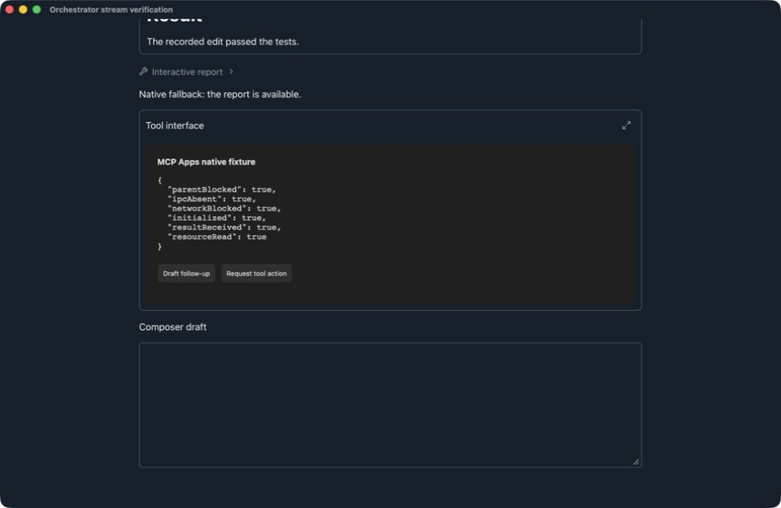
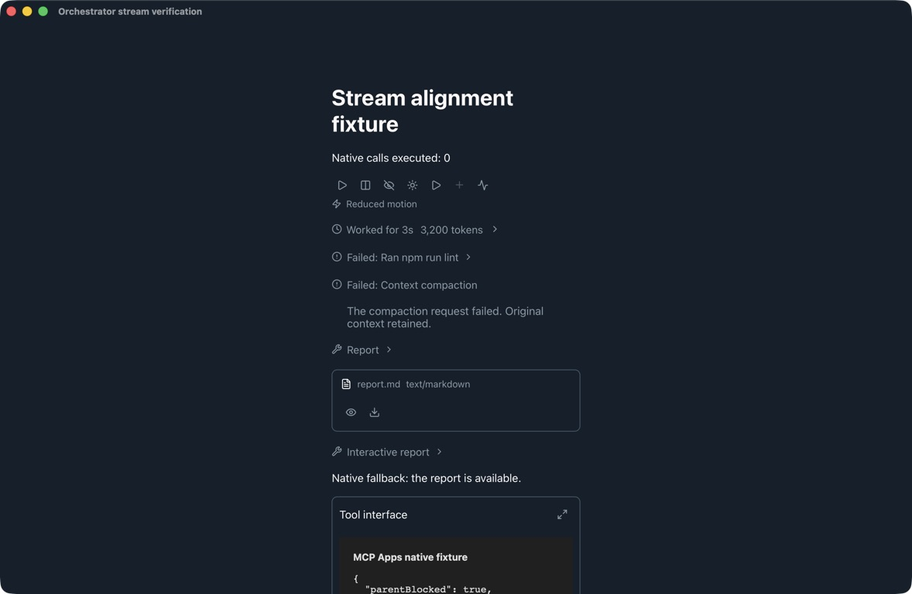
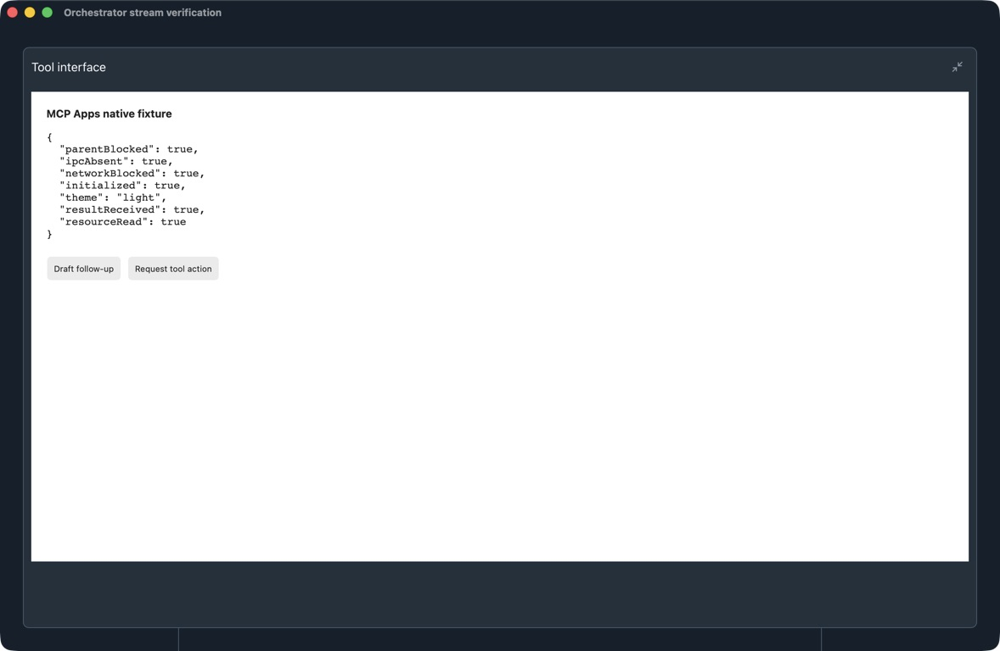
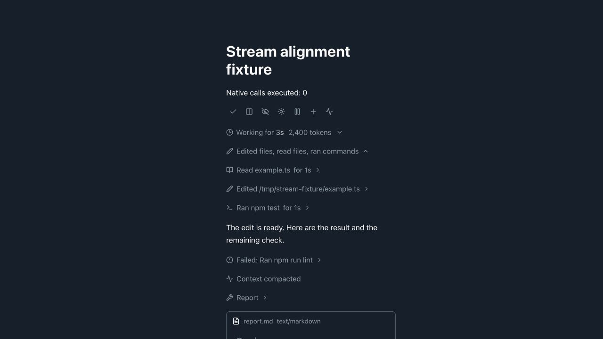
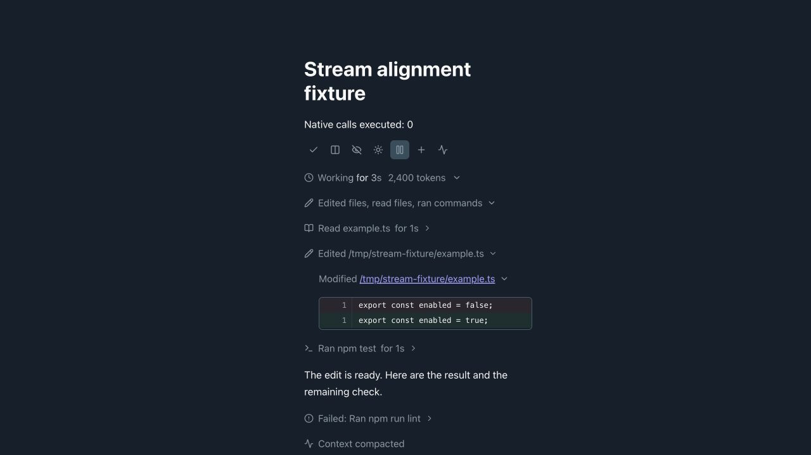
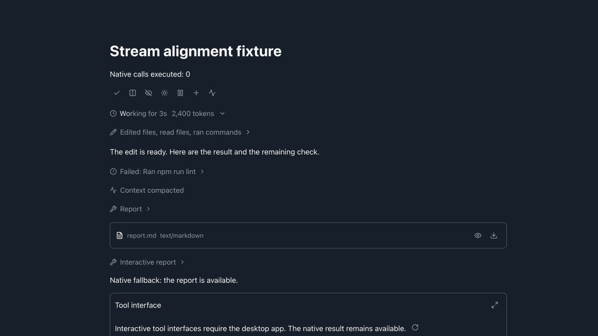

# App-server stream alignment

The reference inspected on 2026-09-12 was `/Applications/ChatGPT.app/Contents/Resources/app.asar`. Its package identifies as `openai-codex-electron` version `26.908.40834`. The main and webview bundles implement indexed text queues, completion draining, separate command-output batching, and working/worked/stopped activity disclosures. This is evidence of that installed Codex implementation, not a claim about every ChatGPT client.

The [official app-server protocol](https://learn.chatgpt.com/docs/app-server) defines reasoning summary/content indexes and makes completed items authoritative.

## Implementation

- `CodexStreamScheduler` owns presentation buffering and per-thread notification serialization. Original events are recorded at ingress, independently of animation. Buffered updates retain their owning run to prevent routing them to another chat after navigation.
- Text targets include thread, turn, item, profile, and reasoning-part identity. Assistant, plan, and reasoning-content text reveal at 24 UTF-16 code units per frame without splitting surrogate pairs. Reasoning summaries publish together; command output batches every 50 ms.
- Normal completion drains within eight frames. Approval, interruption, error, visibility/reduced-motion changes, and teardown flush immediately. A 16 ms timer publishes text when animation frames are unavailable.
- Recovery/removal clears obsolete presentation buffers and invalidates queued lifecycle handlers. Stored protocol events remain unchanged and replay directly through the reducer, without typing animation.
- Reasoning summaries and content remain separate. Completed items replace streamed text in place; fragments on either side of a user steer retain their positions. Empty identified items reserve chronology without showing empty rows. Legacy lifecycle notifications without item identity retain their generic presentation.
- Main and subagent transcripts share activity rows and disclosures. Completed activity collapses by default. Explicit disclosure choices survive updates; active and failed commands/tools remain visible. Command output is expandable. Historical subagent projections expose only the information supplied by their endpoint.

## Validation

Deterministic tests cover scheduling, completion ordering, visibility fallback, recovery, indexed reasoning, authoritative completion, steering boundaries, command output, transcript disclosures, and replay. Runtime regression tests cover approvals, Goals, generated images, plans, history, file links, typing, and scroll anchoring.

Browser checks use the shared React components with synthetic protocol events to inspect text reveal, command output, completion disclosures, and background/restore behavior. Direct UI inspection of the installed reference app was blocked by the computer-use tool; reference behavior was verified from its bundle. No live model turn is required by the tests.

## Presentation follow-up (2026-09-16)

Re-inspected the installed Codex bundle, now `openai-codex-electron` version
`26.908.70816`. Direct UI inspection of Codex remains unavailable to the
computer-use tool. The reference evidence is the installed application source:

- `app-primary-4af6ed7f68d1.js` segments text into words and remembers settled
  segments. `app-initial-a09fe9cd72bc.css` applies a 150 ms opacity fade with
  `cubic-bezier(.37, .55, .86, .88)`; reduced motion disables it.
- `local-conversation-page-a62e53753522.css` and `app-dddf03d14541.css` use a
  two-second shimmer for working text.
- `conversation-blocks-ff6853707ff6.js` renders muted command summaries as a
  disclosure, with the raw command, output, and exit status in its terminal body.
  Activity expansion uses a short opacity/translation transition.

Orchestrator now implements these presentation behaviors independently. The
scheduler still controls data publication; `StreamingText.tsx` fades only new
text in the main transcript and subagent inspector. Previously visible text
stays settled through Markdown updates, reopening, history, and navigation.
Completion, hidden windows, and reduced motion cancel outstanding fades. The
implementation also resumes fades through React StrictMode's development-only
mount-effect replay.

At this stage, token totals inherited the metrics size (`0.83rem`), undoing
the additional `0.85em` reduction. The refinement below supersedes that size
with the shared activity typography. Failed commands keep a compact neutral summary
with a failure icon. Expanding it reveals selectable, bounded terminal output
and the recorded exit code; durations below one second no longer say `for 0s`.
Failures remain visible outside collapsed activity, and open command output
stays open through updates and execution completion.

Validation includes tests for new-word animation, settled Markdown nodes,
StrictMode, visibility/reduced motion, completion, Unicode and Markdown
structure, command disclosure persistence, failure details, and exit-code
replay. A browser review of the shared production components confirmed equal
13.28 px token/elapsed-time text, active word opacity changes, zero word
animations after completion, Enter-key disclosure operation, and readable
failure output at wide and 360 px transcript widths. The browser review used
synthetic stream updates rather than a live model turn.

Command rows and their output panels now appear without an entrance animation.
The command list uses consistent spacing between status groups, and only rows
nested inside a completed group receive the disclosure's top margin. Running
rows and completed group summaries share the same line height. Browser checks
at 720 px and 360 px confirmed equal 18 px surrounding gaps for running,
completed, and failed commands, and unchanged output-panel dimensions and
padding when an expanded command completes.

## Activity and artifact alignment (2026-09-17)

The presentation reference is Codex `26.908.70816`; the protocol baseline remains
Orchestrator's pinned engine `0.153.4`. No engine upgrade, database migration, or
historical backfill is required. The baseline schema was generated from the
pinned executable and checked against the [official app-server documentation](https://learn.chatgpt.com/docs/app-server).

The checked-in [coverage matrix](stream-coverage.json) inventories all **19 item
variants and 83 server notifications** in that baseline. Every entry identifies
its disposition, renderer or owner, lifecycle, history behavior, and relevant
tests. Application bookkeeping entries are intentionally outside the transcript;
they do not imply new account, realtime, or platform features.

The supplied reference screenshots show the mixed summary and icon precedence:


### Shared stream

`streamActivity.ts` stores typed activities using profile, thread, turn, and item
identity. The reducer retains command classifications and working directories,
patch revisions, progress, terminal interactions, result metadata, and explicit
detail availability. Terminal lifecycle events are authoritative: later starts
and deltas cannot resurrect completed work. Interrupted unfinished work remains
interrupted. Unknown items have an expandable native activity row without raw
protocol envelopes.

`runTimeline.ts` joins activity anchors with commentary, reasoning, steering,
plans, images, artifacts, and system boundaries. `StreamActivities` groups
consecutive successful ordinary activities, including compound commands with
one output disclosure. Reads, searches, and listings use the book category;
unclassified commands keep terminal presentation. Active, awaiting approval,
failed, declined, and interrupted rows remain exposed. Explicit expansion
survives completion and virtualized remounts. Routine actions use the existing
icon-only button style, with accessible labels and tooltips.

Per-edit patches are displayed lazily using the existing diff preparation and
virtualization components. Small patches size to their contents; large patches
have a bounded scroll viewport. Recorded patches are independent of current
file contents. `turn/diff/updated` replaces the final aggregate diff, preserving
the existing edited-file review and undo controls without accumulating repeated
edit totals.

Main, restored, and subagent transcripts use the same normalization and result
components. Rust projections return lightweight ordered event summaries; large
bodies are fetched on disclosure through a profile/thread/turn/item-scoped
endpoint. Local event sequence and server page order are retained, including
lifecycle fragments split across pages and multiple turns in a local run.
Existing event redaction remains in force. Missing or redacted bodies say
“Details unavailable.” History caches and geometry fingerprints include activity
content and disclosure revisions. Older records can only show metadata and
boundaries their source actually retained.

### Rich content and interactive views

`ActivityResult` renders sanitized Markdown, expandable structured data, images,
audio/video URLs or supplied media data, resource links, and embedded resources.
Artifact cards expose type and independent icon-only preview/download actions;
preview availability is represented by the presence of its button. Image and link handling reuse existing application components. Local
media without an inline source opens through the existing file handler;
unsupported binary document formats download for an external application.
Artifacts remain standalone chronological blocks when ordinary activity is
collapsed.

`McpAppWidget` hosts standard MCP Apps using the official
[AppBridge](https://apps.extensions.modelcontextprotocol.io/api/classes/app-bridge.AppBridge.html)
with manual handlers. It prefers `appContext.resourceUri` and recognizes legacy
resource metadata. Resource reads retain the originating server, thread,
connector, and call identity. Widgets receive initialization, input/results,
theme/display-mode updates, bounded resize, cancellation, and teardown.

The main application's frame CSP permits the dedicated `orchestrator-widget`
origin. Its trusted proxy embeds widget HTML in an opaque sandbox with scripts
but without same-origin privileges. Source-window validation guards the relay;
the inner resource CSP restricts network origins and disallows nested frames,
objects, forms, and base URL changes. Widget code cannot access the parent DOM
or Tauri IPC. HTML is limited to 4 MiB per widget and 32 simultaneous widgets;
downloads use the native save dialog and a 16 MiB decoded-content limit.

Widget messages fill the composer. Tool requests wait for an explicit host Run
action and stay scoped to the originating app-server connection. Restoring,
expanding, and remounting a result never repeats a tool mutation. Native content
remains available when the interface is missing, incompatible, or fails.
Codex-private services and proprietary editors without accessible protocol data
use native result/artifact presentation.

### Verification fixture

Run the following to view `streamAlignmentDiagnostics.tsx`:

```sh
VITE_STREAM_ALIGNMENT_PROFILE=1 npm run dev -- --host 127.0.0.1 --port 1432 --strictPort
```

The opt-in fixture uses
production stream components with synthetic protocol data and a local widget;
it never starts a model turn or changes a connected service. It includes mixed
reads/edits/commands, commentary boundaries, failure output, compaction, an
artifact, an MCP Apps interface, completion, remount, and narrow-layout controls.

Browser checks cover keyboard disclosure, persistent expansion, small recorded
diffs, artifact controls, narrow layouts, and the desktop-only widget fallback.
Native Tauri checks additionally verify the real custom-protocol proxy and
inner frame: parent access blocked, no Tauri IPC, undeclared network blocked,
initialization, tool-result delivery, scoped resource reading, composer drafts,
host-gated actions, and no repeat mutation after remount. These are fixture
checks, not a claim that every third-party widget has been certified.

Automated validation includes the activity/lifecycle/history suites, shared
renderer and origin-routing tests, widget bridge and unauthorized-frame tests,
recorded-patch preparation, existing transcript/scroll/plan/approval regressions,
Rust projection/redaction and sandbox-policy tests, generated bindings,
architecture checks, and the production build.

Verification results on 2026-09-17: the full frontend suite passed 1,738 tests
with two workers; the final focused pass, including the additional trace-remount
and steering-pagination cases, passed 93 tests. Rust passed 256 tests with three
existing ignored tests. Generated-binding and architecture checks passed, as
did the final production build. The coverage inventory was compared directly
with the pinned engine's generated item and notification unions.

## Layout, controls, and metrics refinement (2026-09-17)

The mixed summary now fits its label, with a 7 px trailing chevron gap and
wrapping at narrow widths. Native summary elements retain keyboard activation
and persisted expansion. Context compaction is a plain icon/status row:
“Compacting context” while running, “Context compacted” after completion, or
failure details inline. It has no disclosure or duplicated body and remains
visible outside a collapsed trace.

`activityPreview.ts` centralizes preview capability. Embedded text and supported
image/audio/video content have previews; supported MIME metadata plus an
origin-scoped resource route permits an on-demand preview. HTML/XML use inert
source previews. Unsupported documents retain independent download/open
capabilities without a misleading preview button. Missing or incompatible
resource responses and read failures hide the preview action and expose the
error. Resource URI matching prevents another returned resource from becoming
the preview. There are no standing availability captions or empty action rows.

`streamMetrics.ts` supplies the same per-turn token formatter to the main
transcript and demo. The demo receives synthetic token notifications and offers
an icon-only control to advance them. Live updates, completion, steering, and
restored history show one count per run. Missing turn totals retain the existing
pending/unavailable states; cumulative thread totals are never substituted.

The shared activity typography is 0.95 rem with a 1.45 line height. The
`--stream-entry-gap` token supplies 18 px between peer entries, expanded group
rows, and disclosure headers and bodies. Results, artifacts, and widgets no
longer add competing outer margins. Card and code-panel padding and separate
Markdown/code typography are retained. Subagent rows use the same rhythm.
Transcript measurements now use `activities-v3` to discard the old geometry,
including the compact artifact header introduced below.

### Refinement validation

Focused runs passed **199 distinct frontend tests**, covering artifact capability
and read failures, compaction, token accounting and production rendering,
steering/reopening, native-startup virtualization, scroll anchoring, and historical
caches. TypeScript, architecture checks (the existing six-item baseline), and
the production build passed. The build retains existing dependency annotation
and chunk-size notices. This refinement adds no Rust/Tauri, database, protocol,
or execution-permission changes.

Browser fixture measurements at **850 px and 360 px** confirmed 18 px peer,
group, disclosure, artifact, and widget gaps, a 7 px summary-chevron gap, and
15.2 px activity/elapsed/token labels with 22.04 px line height. The narrow
fixture had no horizontal content overflow. Enter activated group and edit
disclosures. Open details survived completion and remount; compaction remained
visible when the trace collapsed. The measured values are checked in as
[geometry evidence](images/stream-alignment/refinement-geometry.json).

Native Tauri review covered active/completed/failed compaction, icon-only artifact
actions, token updates and restored counts, remount, and widget expansion. Both
**widget** theme contexts were reviewed. Orchestrator currently enforces a dark
application palette in `theme.ts` and its root CSS, so there is no separate
production light application theme to validate. The demo's theme control changes
the widget context only. Its reduced-motion control disables stream animation
and transitions locally for review; it does not alter the operating-system or
saved application preferences. Browser computed styles confirmed `animation:
none` for working labels and trace entry. Native sandbox checks still report
parent access blocked, IPC absent, undeclared network blocked, initialization,
result delivery, and scoped resource reading; remounts did not execute a tool.







Activity durations now read “for 1s” alongside the label, using the same size
and baseline instead of a smaller `small` element. Longer durations reuse the
existing hours/minutes/seconds formatter. Browser checks at 360 px confirmed
matching 15.2 px type, 22.04 px line height, and no row overflow.



All stream disclosures now use the same right-pointing chevron when collapsed
and downward chevron when expanded. One shared CSS rule reads the owning
`details[open]` or button `aria-expanded` state, so opening a parent cannot rotate
a collapsed child's arrow. This includes trace/group headers, individual
activities, per-file edits, tool inputs, structured results, file-list expansion,
and long-plan expansion. Keyboard activation and reduced-motion behavior remain
intact. Browser checks verified nested open/closed states at 360 px without
overflow; 75 focused component tests, TypeScript, architecture, and the build
passed for this follow-up.



Artifact preview and download controls now sit at the header's right edge,
aligned with the filename and MIME type. The file identity remains on the left
and wraps within its available space. Availability, tooltips, loading/error
feedback, and the 18 px header-to-preview gap are preserved. Browser measurements
at 850 px and 360 px confirmed equal text/control vertical centers, 13 px right
inset including the border, and no overflow. The compact unexpanded fixture card
is 56 px tall. The focused renderer/geometry pass (34 tests), TypeScript,
architecture checks, and production build passed.


